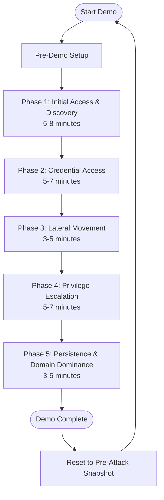

# Baker Street Scenarios Architecture

**Last Updated**: 2026-01-08

---

## Infrastructure Overview

### Component Architecture

The Baker Street Scenarios infrastructure consists of multiple integrated scenario environments:

1. **Active Directory Attack Simulation** - Primary active scenario (Platform Range foundation)
2. **Range XDR Attack Scenario** - XDR product demonstrations
3. **Range XSIAM Attack Scenario** - XSIAM product demonstrations
4. **Platform Range Attack Scenario** - Automated SSH-accessible infrastructure
5. **Live Fire Range** - Intentionally vulnerable web applications

---

## Active Directory Attack Simulation Architecture

### Network Topology

**Primary Network**: `10.0.0.0/24` (isolated lab network)  
**Gateway**: `10.0.0.1` (if internet access needed)  
**DNS Server**: `10.0.0.10` (DC01)

### Virtual Machine Specifications

| Machine | Role | vCPU | RAM | Disk | IP Address |
|---------|------|------|-----|------|------------|
| **DC01** | Domain Controller, DNS, DHCP | 2 | 4-6GB | 60GB | 10.0.0.10 |
| **CA01** | Certificate Authority | 2 | 4GB | 60GB | 10.0.0.15 |
| **CLIENT01** | Domain Workstation | 2 | 4GB | 60GB | 10.0.0.21 |
| **CLIENT02** | Domain Workstation | 2 | 4GB | 60GB | 10.0.0.22 |
| **ATTACKER** | Attacker Workstation | 2 | 4-6GB | 80GB | 10.0.0.100 |

### Domain Configuration

**Domain Name**: `demo.local`  
**NetBIOS Name**: `DEMO`  
**Forest/Domain Functional Level**: Windows Server 2016 or higher

### Certificate Authority

**CA Type**: Enterprise Root CA (AD-integrated, single-tier)  
**CA Name**: "Baker Street Labs Root CA"  
**CA Server**: CA01 (10.0.0.15) or DC01 (if combined)

**Vulnerable Template**: `VulnerableUserCert`
- Subject: Supply in the request (ESC1 vulnerability)
- Enrollment: Domain Users can enroll
- Purpose: Signature and encryption
- Key Usage: Exportable private key

---

## Range XDR Attack Scenario Architecture

### Network Configuration

**Domain**: `moriartyxdr.ad.bakerstreetlabs.io`  
**Network**: `172.29.0.0/16` (per subnet)  
**DC01**: `172.29.4.65`  
**CA Server**: RangeXDR-AD01 (combined with DC01)

### Configuration Automation

**Script**: `scripts/Configure-AD-Complete-XDR.ps1`  
**Features**:
- Complete user account creation (admins, service accounts, standard users)
- SPN registration for Kerberoasting
- AS-REP roasting account configuration
- Shadow Credentials permissions
- ESC1 certificate template creation

---

## Range XSIAM Attack Scenario Architecture

### Network Configuration

**Domain**: `moriartysiam.ad.bakerstreetlabs.io`  
**Network**: `172.30.3.0/24`  
**CA Server**: CA01 (separate)

### Configuration Automation

**Script**: `scripts/Configure-AD-Complete-XSIAM.ps1`  
**Features**:
- XSIAM-specific user accounts and configurations
- Security analytics integration points
- Certificate template configuration
- Attack tool deployment

---

## Platform Range Attack Scenario Architecture

### Network Configuration

**Domain**: `platform.bakerstreetlabs.io` (standalone forest)  
**Network**: `172.31.4.0/24`  
**DC01/AD01**: `172.31.4.65`  
**SSH Port**: 42425  
**NAT Access**: `192.168.255.254` (port mappings)

### Unique Architecture

**SSH-Accessible Infrastructure**:
- All Windows VMs have OpenSSH configured
- SSH access via NAT with port mappings
- AWX/Ansible automation ready

**Automation**:
- Modular PowerShell scripts (`scripts/platform/Section*.ps1`)
- Master orchestrator (`Master-Configure-AD-Platform.ps1`)
- Common functions (`Platform-AD-Common.ps1`)

**Simplified Architecture**:
- Standalone forest (child-parent structure removed)
- Single-tier PKI (Root CA only)
- Streamlined for automation

---

## Live Fire Range Architecture

### Network Configuration

**Network**: `172.30.3.80/28` (macvlan on cybernet network)  
**Type**: Docker macvlan network  
**Gateway**: `172.30.3.1`  
**Host Helper**: `172.30.3.79/32` (cyber-mac interface)

### Service Architecture

**Containerized Services**:
- Apache (Log4Shell vulnerability) - `172.30.3.80`
- Log4J sample - `172.30.3.81:8080`
- Jenkins - `172.30.3.82:8080`
- WordPress + MySQL - `172.30.3.83/84`
- Joomla + MySQL - `172.30.3.85/86`
- Struts - `172.30.3.87:8081`
- Drupal + MySQL - `172.30.3.88/89`
- Magento + MySQL - `172.30.3.90/91`
- phpMyAdmin - `172.30.3.92`

**Persistent Storage**: `/opt/bakerstreet-livefire/` on Debian host

**Themed Evidence**: Baker Street Labs-themed artifacts seeded throughout applications

---

## Attack Tool Architecture

### Tool Categories

**Reconnaissance**:
- SharpHound & BloodHound
- PowerView
- SPN enumeration tools

**Credential Access**:
- Rubeus (AS-REP Roasting, Kerberoasting)
- Mimikatz (Pass the Hash, DCSync)
- CrackMapExec (Password Spraying)

**Privilege Escalation**:
- Whisker (Shadow Credentials)
- Certify (ESC1 AD CS exploitation)

**Persistence**:
- Golden Ticket creation tools
- Backdoor account creation scripts

### Tool Installation

**Location**: `C:\Tools\` on ATTACKER machine

**Structure**:
- `C:\Tools\Reconnaissance\` - SharpHound, PowerView
- `C:\Tools\CredentialAccess\` - Rubeus, Mimikatz, CrackMapExec
- `C:\Tools\PrivilegeEscalation\` - Whisker, Certify
- `C:\Tools\LateralMovement\` - Lateral movement tools
- `C:\Tools\Output\` - Tool output files

**Automation**: `scripts/platform/Download-AttackTools.ps1` and upload scripts

---

## Scenario Execution Flow

### Active Directory Attack Simulation Flow

### Attack Technique Sequence

1. **Discovery** (2 techniques):
   - Basic AD Enumeration
   - SharpHound Collection

2. **Credential Access** (4 techniques):
   - SPN Enumeration
   - AS-REP Roasting
   - Kerberoasting
   - Password Spraying

3. **Lateral Movement** (2 techniques):
   - Pass the Hash
   - Pass the Ticket

4. **Privilege Escalation** (2 techniques):
   - Shadow Credentials
   - ESC1 (AD CS)

5. **Persistence** (2 techniques):
   - DCSync
   - Golden Ticket

---

## Detection Architecture

### Detection Points

**12 Critical Detection Points** across the attack chain:

1. **SharpHound Activity Detected** - Mass LDAP enumeration pattern
2. **SPN Enumeration Activity** - ServicePrincipalName attribute queries
3. **AS-REP Roasting Attack Detected** - Kerberos pre-auth bypass
4. **Kerberoasting Attack Detected** - TGS-REQ pattern analysis
5. **Password Spraying Attack Detected** - Multi-account, same-password pattern
6. **Pass the Hash Attack Detected** - NTLM authentication anomaly
7. **Pass the Ticket from Non-Domain Host** - Ticket usage anomaly
8. **Shadow Credentials Attack** - msDS-KeyCredentialLink modification
9. **ESC1 - Certificate Enrollment with Privileged SAN** - Certificate abuse
10. **DCSync Attack - DRSUAPI Call from Non-DC** - Domain replication abuse
11. **Golden Ticket Detected - Anomalous Ticket Lifetime** - Ticket validity anomaly
12. **Domain Admin Account Creation** - Privilege escalation indicator

---

## Integration Architecture

### Security Product Integration

**XDR Integration**:
- Agent deployment on all endpoints
- Event collection and forwarding
- Real-time detection and alerting

**XSIAM Integration**:
- Security analytics platform integration
- Log ingestion and correlation
- Threat intelligence enrichment

### C2 Framework Integration

**Mythic C2**:
- Integration with `baker-street-c2` for advanced scenarios
- Agent deployment during attack execution
- C2 channel simulation

### Traffic Generation Integration

**Traffic Generators**:
- Integration with `baker-street-traffic-generators` for background noise
- Realistic user behavior simulation
- Network traffic injection

---

## Snapshot Strategy

### Snapshot Points

1. **Clean Install** - After OS installation and networking
2. **Domain Ready** - After domain join and basic configuration
3. **Pre-Attack** - After all vulnerable configurations in place (PRIMARY RESET POINT)
4. **Mid-Attack** (Optional) - After reconnaissance phase

### Snapshot Management

**Best Practices**:
- Clean event logs before snapshots
- Clear PowerShell history
- Empty recycle bins
- Stop unnecessary services
- Use descriptive snapshot names with dates

---

## Security Considerations

### Isolation

**Network Isolation**:
- Lab networks isolated from production
- No bridging to corporate networks
- Separate physical or virtual network segments

**VM Isolation**:
- Snapshots for easy reset
- Clean state between demos
- No persistent changes between executions

### Credential Management

**Demo Credentials**:
- All accounts use password `Cortex1!` or `P@ssw0rd123!`
- Documented for demo purposes only
- Never use in production

**API Keys and Tokens**:
- Stored in `.secrets` file
- Not committed to git
- Rotated regularly

---

## Performance Architecture

### Resource Requirements

**Host Machine Minimum**:
- CPU: Quad-core with virtualization support
- RAM: 20GB (24GB recommended)
- Disk: 300GB available (500GB SSD recommended)

**Total VM Resources**:
- vCPU: 10 cores total
- RAM: 20GB total
- Disk: 320GB total

### Execution Performance

**Infrastructure Setup**: 4-6 hours (one-time)  
**Configuration**: 2-3 hours  
**Demo Execution**: 20-30 minutes  
**Reset Time**: < 5 minutes (snapshot revert)

---

## Related Documentation

- **STATUS.md** - Current operational status
- **CHANGES.md** - Development history and changes
- **DESIGN.md** - Scenario workflow diagrams
- **ROADMAP.md** - Future development plans

---

**Maintained By**: Baker Street Labs Infrastructure Team  
**Last Architecture Review**: 2026-01-08

