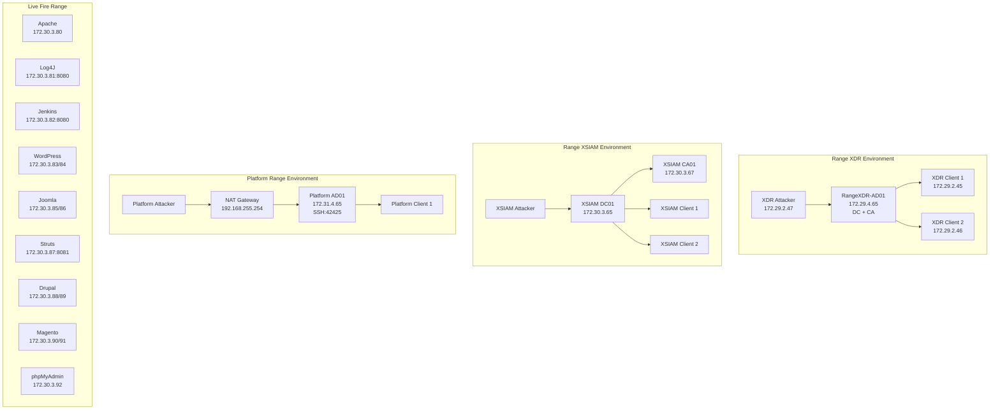
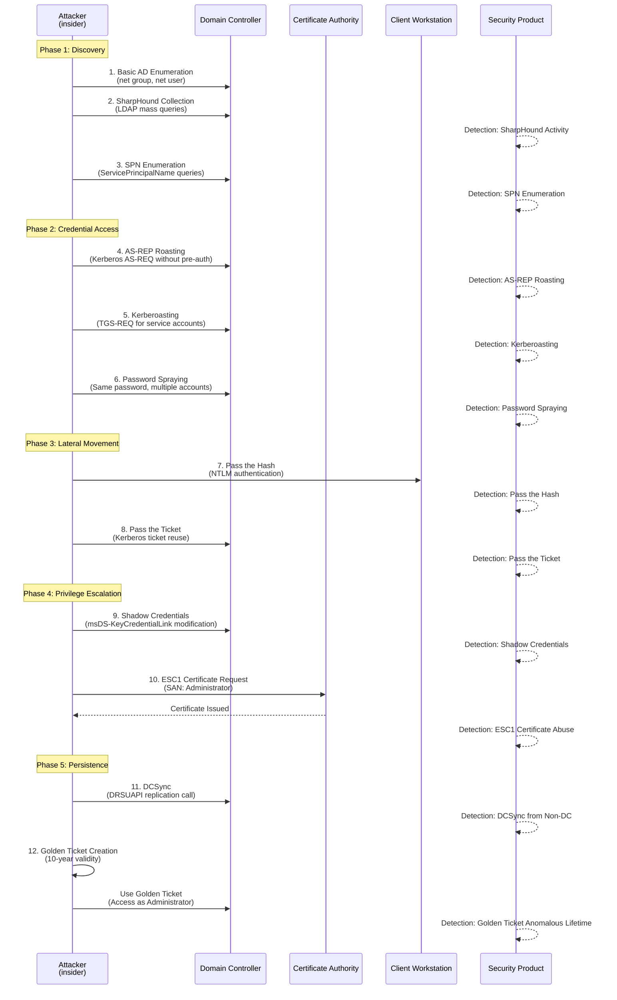
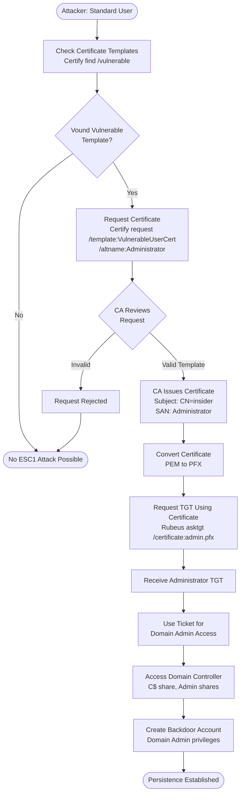
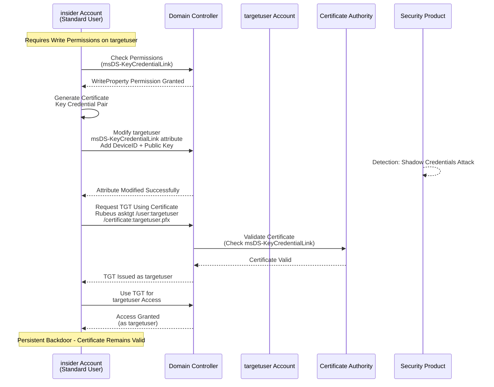
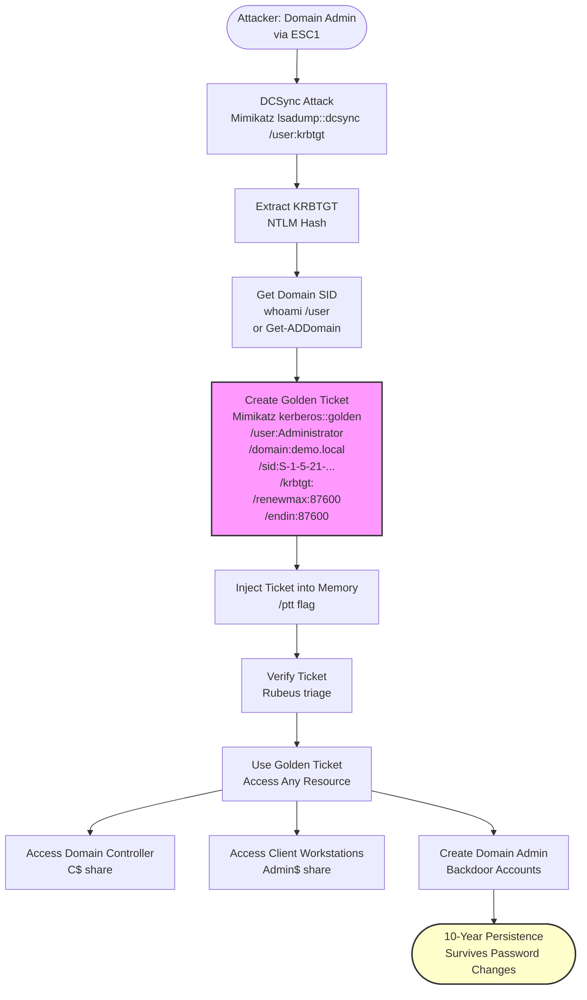

# Baker Street Scenarios Design Diagrams

All design maps and diagrams for scenario infrastructure, rendered in Mermaid format.

---

## Active Directory Attack Simulation - Complete Flow

```mermaid
graph TD
    Start([Demo Start]) --> Prep[Pre-Demo Setup<br/>- Start All VMs<br/>- Verify Security Product<br/>- Clear Event Logs<br/>- Login as Insider]
    
    Prep --> Phase1[Phase 1: Initial Access & Discovery<br/>Duration: 5-8 minutes]
    
    Phase1 --> P1_Step1[1.1 Verify Initial Access<br/>whoami, domain connectivity]
    P1_Step1 --> P1_Step2[1.2 Basic Domain Enumeration<br/>net group, net user]
    P1_Step2 --> P1_Step3[1.3 SharpHound Collection<br/>-c All -d demo.local]
    P1_Step3 --> P1_Step4[1.4 SPN Discovery<br/>Rubeus kerberoast /stats]
    P1_Step4 --> Detection1[Detection: SharpHound Activity]
    Detection1 --> Detection2[Detection: SPN Enumeration]
    
    Detection2 --> Phase2[Phase 2: Credential Access<br/>Duration: 5-7 minutes]
    
    Phase2 --> P2_Step1[2.1 AS-REP Roasting<br/>Rubeus asreproast]
    P2_Step1 --> P2_Step2[2.2 Kerberoasting<br/>Rubeus kerberoast]
    P2_Step2 --> P2_Step3[2.3 Password Spraying<br/>CrackMapExec]
    P2_Step3 --> Detection3[Detection: AS-REP Roasting]
    Detection3 --> Detection4[Detection: Kerberoasting]
    Detection4 --> Detection5[Detection: Password Spraying]
    
    Detection5 --> Phase3[Phase 3: Lateral Movement<br/>Duration: 3-5 minutes]
    
    Phase3 --> P3_Step1[3.1 Pass the Hash<br/>Mimikatz sekurlsa::pth]
    P3_Step1 --> P3_Step2[3.2 Pass the Ticket<br/>Rubeus ptt]
    P3_Step2 --> Detection6[Detection: Pass the Hash]
    Detection6 --> Detection7[Detection: Pass the Ticket]
    
    Detection7 --> Phase4[Phase 4: Privilege Escalation<br/>Duration: 5-7 minutes]
    
    Phase4 --> P4_Step1[4.1 Shadow Credentials<br/>Whisker add /target:targetuser]
    P4_Step1 --> P4_Step2[4.2 ESC1 Certificate Attack<br/>Certify request /altname:Administrator]
    P4_Step2 --> Detection8[Detection: Shadow Credentials]
    Detection8 --> Detection9[Detection: ESC1 Certificate Abuse]
    
    Detection9 --> Phase5[Phase 5: Persistence & Domain Dominance<br/>Duration: 3-5 minutes]
    
    Phase5 --> P5_Step1[5.1 DCSync<br/>Mimikatz lsadump::dcsync]
    P5_Step1 --> P5_Step2[5.2 Golden Ticket<br/>Mimikatz kerberos::golden]
    P5_Step2 --> Detection10[Detection: DCSync from Non-DC]
    Detection10 --> Detection11[Detection: Golden Ticket Anomalous Lifetime]
    
    Detection11 --> DemoEnd([Demo Complete<br/>12 Detections Total])
    DemoEnd --> Reset[Reset to Pre-Attack Snapshot]
    Reset --> Start
```



---

## Range Infrastructure Architecture



---

## Attack Technique Sequence Diagram



---

## Certificate Attack (ESC1) Flow



---

## Shadow Credentials Attack Flow



---

## Golden Ticket Creation Flow



---

## Platform Range Automation Flow

```mermaid
graph LR
    Start([Start Configuration]) --> Master[Master-Configure-AD-Platform.ps1<br/>Orchestrator]
    
    Master --> Section1[Section01-CreateOUs.ps1<br/>Organizational Units]
    Section1 --> Section2[Section02-CreateAdminAccounts.ps1<br/>Domain Admins, IT Admins]
    Section2 --> Section3[Section03-CreateServiceAccounts.ps1<br/>SPN Registration]
    Section3 --> Section4[Section04-CreateStandardUsers.ps1<br/>Standard Users]
    Section4 --> Section5[Section05-CreateASREPRoastable.ps1<br/>AS-REP Vulnerable]
    Section5 --> Section6[Section06-CreateInsiderAccount.ps1<br/>Compromised Insider]
    Section6 --> Section7[Section07-ShadowCredentials.ps1<br/>Permissions Setup]
    Section7 --> Section8[Section08-CreateCertificateTemplate.ps1<br/>ESC1 Template]
    Section8 --> Section9[Section09-PublishTemplate.ps1<br/>Publish to CA]
    Section9 --> Section10[Section10-DownloadTools.ps1<br/>Attack Tools]
    Section10 --> Section11[Section11-UploadTools.ps1<br/>Distribute Tools]
    Section11 --> Section12[Section12-Verification.ps1<br/>Verify All Config]
    
    Section12 --> Complete([Configuration Complete])
    
    style Master fill:#f9f,stroke:#333,stroke-width:2px
    style Complete fill:#cfc,stroke:#333,stroke-width:2px
```



---

## Live Fire Range Service Architecture

```mermaid
graph TB
    subgraph "Docker macvlan Network (cybernet)"
        subgraph "Training Range (172.30.3.80/28)"
            Apache[Apache<br/>172.30.3.80<br/>221B Incident Board]
            Log4J[Log4J Sample<br/>172.30.3.81:8080<br/>Live Hunt Checklist]
            Jenkins[Jenkins<br/>172.30.3.82:8080<br/>CI Evidence Locker]
            WP[WordPress<br/>172.30.3.83<br/>Baker Street Gazette]
            WP_DB[WordPress DB<br/>172.30.3.84]
            Joomla[Joomla<br/>172.30.3.85<br/>Copper Beeches]
            Joomla_DB[Joomla DB<br/>172.30.3.86]
            Struts[Struts<br/>172.30.3.87:8081<br/>Baskerville Beacon]
            Drupal[Drupal<br/>172.30.3.88<br/>Field Report]
            Drupal_DB[Drupal DB<br/>172.30.3.89]
            Magento[Magento<br/>172.30.3.90<br/>E-commerce Orders]
            Magento_DB[Magento DB<br/>172.30.3.91]
            phpMyAdmin[phpMyAdmin<br/>172.30.3.92<br/>Academic Disclaimer]
        end
    end
    
    subgraph "Host Storage"
        Persistent[/opt/bakerstreet-livefire/<br/>Persistent Evidence]
    end
    
    WP --> WP_DB
    Joomla --> Joomla_DB
    Drupal --> Drupal_DB
    Magento --> Magento_DB
    Persistent --> Apache
    Persistent --> Log4J
    Persistent --> Jenkins
    Persistent --> WP
    Persistent --> Joomla
    Persistent --> Struts
    Persistent --> Drupal
    Persistent --> Magento
```

---

## Detection Points Timeline

```mermaid
gantt
    title Active Directory Attack Simulation - Detection Timeline
    dateFormat mm
    axisFormat %M min
    
    section Discovery
    Basic Enumeration       :0, 2
    SharpHound Detection    :2, 3
    SPN Enumeration         :5, 1
    
    section Credential Access
    AS-REP Roasting         :6, 2
    Kerberoasting           :8, 2
    Password Spraying       :10, 3
    
    section Lateral Movement
    Pass the Hash           :13, 2
    Pass the Ticket         :15, 1
    
    section Privilege Escalation
    Shadow Credentials      :16, 2
    ESC1 Certificate        :18, 2
    
    section Persistence
    DCSync                  :20, 2
    Golden Ticket           :22, 3
```



---

**Last Updated**: 2026-01-08  
**Maintained By**: Baker Street Labs Infrastructure Team

